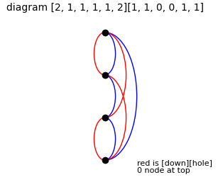
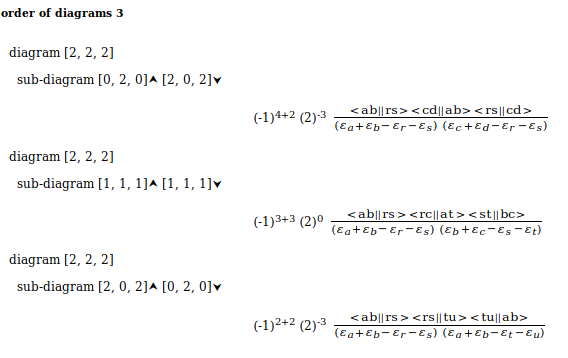

# Many-body Perturbation Theory

This module will generate the Hugenholtz diagrams for a particular order (nodes). It will then generate all 'hole' and particle combinations for the base diagrams ie up and down arrow combinations. An HTML file of the equtions for each diagram can be generated, and an example of how to generate python code to evaluate the equations automatically is given. The algorthms are based on those in [this paper](http://cds.cern.ch/record/609508/files/0303069.pdf). Also see Szabo and Ostlund (pg 256-262). 

The rules for constructing a Hugenholtz diagram are:\
For an *n*<sup>th</sup> order diagram, n dots (vertices) are drawn in a column. These vertices are connected by directed lines subject to the conditions
1. Each vertex has two lines pointing in and two pointing out.
2. Each diagram is connected, i.e.  one must be able to go from any one vertex to any other by following some number of lines.
3. No line connects a vertex with itself.
4. Each diagram is topologically distinct.

As an example, this is a 4th diagram \


There are the following routines.\
&nbsp;&nbsp;&nbsp; 0.  **diagrams_hh**\
&nbsp;&nbsp;&nbsp;&nbsp;&nbsp;&nbsp; &nbsp;   Is a global list containing each \[base diagram, up arrow diagram] pair.

1.  **nodalPairCount_hh(order)**\
    parameter - *order* is the order of the diagram set required. Returns the number of pairs of adjacent nodes in the diagram. For the example above **6**.

2.  **nodalLineCount_hh(order)**\
    parameter - *order* is the order of the diagram set required. Returns the number of lines in the diagram. For the example above **8**.

3.  **nodalPairs_hh(order)**\
    parameter - *order* is the order of the diagram set required. Returns a set of sets of nodal pairs. For the example above \[\[0,1],\[0,2],\[0,3],\[1,2],\[1,3],\[2,3]].

4.  **validDiagrams_hh(diagrams, order)**\
    parameters - *diagrams* is a list of diagram specifications (see below), and *order* is the order of the diagrams. The diagram specifications are checked for 4 lines at each node (construction rule 1) and that the diagram is connected (construction rule 2). Returns a boolean flag True is verified, False otherwise.

5.  **nodalPairConnectionsCombinations_hh(connections, nodePair, pairCount, order)**\
    parameters - *connections* is a list of lists, initially set to \[[0] \* nodalPairCount_hh(order)], on exit will contain specification of each node pair, *nodePair* initially set to 0, *pairCount* the number of nodalPairs and *order* is the order of diagrams. This is a recursive routine which builds all possible combinations of lines between the nodes. The number of combinations to reduced to only those valid according to the construction rules. The routine returns a list of all valid combinations for that order eg order 3 will just return [2,2,2], but order 4 will return 12 diagrams including [2,1,1,1,1,2] which is our example. Each diagram can itself have several combinations of up and down arrows as long as they comply with construction rule 1.

6.  **upArrowCombinations_hh(diagramCombinations,order)**\
    parameters - *diagramCombinations* is a list of valid diagrams as returned by the above routine, *order* is the order of diagrams. This routine loops over the diagrams calling upArrow_hh to generate all possible up arrow combinations for the diagram. Returns a list of all valid possible up arrow combinations. For our example [2,1,1,1,1,2] with produce (among others) [1,1,0,0,1,1].

7.  **upArrow_hh(up, nodePair, diagram, pairs, pairCount, order)**\
    parameters - *up* is a list of the number of up arrows at each node, initially set to \[\[0] * pairCount]. On exit it will contain the valid combinations of up lines at each node. *nodePair* is initially 0, *diagram* is the diagram specification, *pairs* is the list of nodal pairs for this order, *pairCount* is the number of nodal pairs. Recursively calls itself to generate all possible up arrow combinations which are checked for validity before being returned by the next routine...

8.  **verifyArrow_hh(up, pairs, diagram, order)**\
    parameters - *up* is the specification of up arrow lines at each node of the diagram, *pairs* is the list of nodal pairs, *diagram* is the specification of the diagram being considered and *order* is the order of the diagram. Checks number of up arrows is exactly 2. Returns boolean True if valid, False otherwise.

9.  **downArrow_hh(diagram, arrow, pairs)**\
    parameters - *diagram* is the base diagram, *arrow* is the up arrow specification and *pairs* are the nodal pair combinations. Returns the down arrow configuation matching the given up arrow one. For our example will return \[1,0,1,1,0,1].

As an example running
```python
import numpy as np

order = 3
diagrams_hh = []

pairCount = nodalPairCount_hh(order)
connections = [[0] * pairCount]
nodePair = 0

diagramCombinations = nodalPairConnectionsCombinations_hh(connections, nodePair, pairCount, order)
upArrowCombinations_hh(diagramCombinations, order)

d = []

for i, diagram in enumerate(diagrams_hh):
    if diagram[0]  != d:
        print('Base diagram ', diagram[0])
        d = diagram[0]  
    print('           arrow combination [',i,'] ', diagram[1], downArrow_hh(diagram[0], diagram[1], nodalPairs_hh(order)))
```
will give
```
Base diagram  [2, 2, 2]
           arrow combination [ 0 ]  [0, 2, 0] [2, 0, 2]
           arrow combination [ 1 ]  [1, 1, 1] [1, 1, 1]
           arrow combination [ 2 ]  [2, 0, 2] [0, 2, 0]
```
10. **connectionFlow_hh(up, down, order)**\
    parameters - *up* the up arrow specification of a diagram, *down* the down arrow combination of a diagram and *order* is the order of the diagrams. This routine generates a full description of the arrows at each node. Each node will have four entries, one for each line connecting it. The specification is of the form \[node 1, node 2, 'u'|'d', 'i'|'o', 'a'] where node n specifies the nodes defining the pair, 'u' or 'd' specify whether the line is up or down, 'i' or 'o' specifies whether the line in in or out of the node and 'a' can be any literal label. The labelling here is 'a-h' for down lines and 'r-y' for up.
    For node 0 for our example the specification would be \[0,1,'d','o','a'],\[0,1,'u','i','r'],\[0,2,'d','o','b'],\[0,3,'u','i','s']. Note Szabo and Ostlund number their nodes from the bottom up - this is equivalent to swapping up and down arrow labels - this routines changes to this numbering.

11. **rules_hh(flows, order)**\
    parameters - *flows* the specification of lines at nodes as produced by connectionFlow_hh, *order* is the order of the diagrams. This routine evalutes the rules for determining the analytic expressions for the energy corrections. These rules are
    1.  Each dot contributes an antisymmetric matrix element <in<sub>1</sub>in<sub>2</sub>||out<sub>1</sub>out<sub>2</sub>> to the numerator.
    2.  Each pair of adjacent vertices contributes the denominator factor **&Sigma;** &epsilon;<sub>holes</sub> - **&Sigma;** &epsilon;<sub>particles</sub> 
    where the sums run over the labels of all hole and particle lines ceossing an imaginary line separating the pair of vertices.
    3.  The overall sign of the expression is(-1)<sup>h+l</sup>, where *h* and *l* are the number of hole lines and closed loops respectively. 
    4.  Sum expression over all hole and particle indices.
    5. Multiply the expression by a weight factor 2<sup>-2</sup>, where k is the number of equivalent lines. Two lines are equivalent is they share the same nodes and their directions are the same.

    This routine will return for order 3
```
[0,2,0]
['abrs,cdab,rscd', ['a+b-r-s', 'c+d-r-s'], [4, 2], ['a->r->c->a', 'b->s->d->b'], 3]

[2,0,2]
['abrs,rstu,tuab', ['a+b-r-s', 'a+b-t-u'], [2, 2], ['a->r->t->a', 'b->s->u->b'], 3]

[1,1,1]
['abrs,rcat,stbc', ['a+b-r-s', 'b+c-s-t'], [3, 3], ['a->r->a', 'b->s->b', 'c->t->c'], 0]
```
These values are \[the einsum type expression for the double bar integral product, the orbital energy sums in the denominator, hole lines and closed loops, closed loop calculation, equivalent lines].

These results can be compared with Szabo & Ostlund pg 361. It is not immediately clear that \[1,1,1] is equivalent to the S&O version, however we can see that
'abrs,rcat,stbc' is, since ab are just labels and can be swapped ->\
'bars,rcbt,stac' which is since rs are also just labels ->\
'basr,scbt,rtac' which changing order of terms and noting <12||34> = <21||43> ->
'abrs,cstb,rtac' which is the same as Szabo and Ostlund labelling.

12. **HTMLDiagrams_hh(order, filename)**\
    parameters - *order* is the order of the diagrams and *filename* is a file descriptor. This routine will produce an HTML file specied by filename containing the algebraic representation of the diagrams. For order 3 the result is
    

13. **codeDiagrams_hh(order)**\
    parameter - *order* is the order of the diagrams. This routine uses the results of the above routines to generate python code to evaluate MPn energies. The python code required to evaluate the energies is generated from the diagrams and then executed via exec() to return the moller-plesset energy. 

14. **mbptEvaluateMPn(scf, mp = [2, 3, 4])** \
    parameter - *scf* is the scf energy and *mp* is a list of mp-orders to be computed. Uses codeDiagrams to evaluate the requested energies. For default writes values to view module for HTML output and also returns a list of requested values.
    
Example for water STO-3G
| level of theory |                |
|-----------------|----------------|
|  mp2            |-0.049150       |
| mp3             |-0.014188       |
| mp4             |-0.004690       |
|  scf            |-74.942080      |
| scf + correction | -75.010108    |

    


