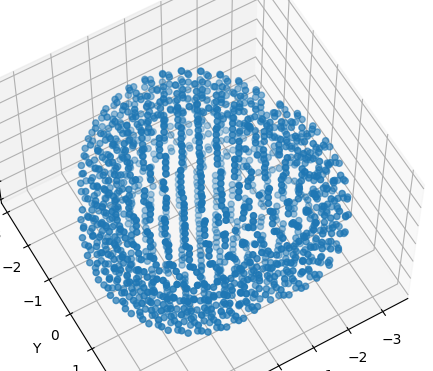

# Restrained Electrostatic Potentials

This follows the reference C. I. Bayly et. al. J. Phys. Chem. 97, 10269 (1993). Firstly a surface or set of surfaces are generated based on the Van der Vaals radii of the atoms in the molecule. These surfaces contain the points on which the electrostatic potential is to be sampled. Below is an example one set of surfaces (shell) of the water molecule. A worthwhile reference is also the multiwfn manual pg 85-89 .

A density of points is specified and an algorithm distributes the points at that density over the shell. Algorithms used can be eg Connolly surfaces (https://en.wikipedia.org/wiki/Accessible_surface_area), Fibonacci based  (https://code-examples.net/en/q/927f21) or Saff and Kuijlaars algorithm (https://perswww.kuleuven.be/~u0017946/publications/Papers97/art97a-Saff-Kuijlaars-MI/Saff-Kuijlaars-MathIntel97.pdf). The shells are a continuous hollow surface, meaning points centered on one atom that lie inside the radius of another atom are removed. The electrostatic potential is then calculated at all points on the spherical grid. Constraints can then be imposed and the system is solved using Lagrange multipliers for the charges on the atoms.

1. **equiDistribution(points=45, variant='con')**

    parameters - *points* is the number of points to be plotted on the atomic surface, usually the result of a previous density calculation. *variants* is one of 'con' for a Connolly surface or 'fib' for a fibonacci golden spiral coverage. Computes a regular spaced point distribution on a unit sphere and returns the array of points.

2. **surfaceView(distribution)**

    parameters - *distribution* is the array of distributed points. Plots a 3-d scatter plot of the surface distribution of points (as in figure above).

3. **respData(molAtom, molBasis, molData, options)**

    parameters - *molAtom* is an array of atom objects (the molecular geometry), *molBasis* is an array of basis objects (the molecular basis), *molData* are the parameters of the scf calculation and *options* are the parameters for the resp calculation. Routine processes options, calls equiDistribution to generate a surface or shells of surfaces, removes internal points for each shell, calculates the electrostatic potential at all points on all shells and saves points and esp values in a .npz file. For computational convenience an array of inverse distances from all distribution points to each atomic center is also stored.

4. **buildmatrix(invRadii, constraintLength, nAtoms))**

    parameters - *invRadii* is an array of inverse distances from all points to all atom centers ([points, atoms]), *constaintLength* is the number of contraints imposed on the system and *nAtoms* is the number of atomic centers in the system. Computes the matrix **A** in the Lagrange multiplier problem **A**q=**b**. **A** is essentially the product of inverse distances.

5. **buildvector(invRadii, esp, constraintLength, nAtoms, charge)**

    parameters - *invRadii* is an array of inverse distances from all points to all atom centers ([points, atoms]), *esp* is an array of electrostatic potentials evaluated at points in the distribution, *constaintLength* is the number of contraints imposed on the system, *nAtoms* is the number of atomic centers in the system and *charge* is the overall molecular charge. Computes the vector **b** in the Lagrange multiplier problem **A**q=**b**. **b** is essentially the product of inverse distance and the electrostatic potential.

6. **restrainedESP(molAtom, molBasis, molData, options)**

    parameter - *molAtom* is an array of atom objects, *molBasis* is an array of basis objects, *molData* are the molecular run parameters and *options* are the parameters for the resp calculation. Routine calls rhf.mol to get molecular parameters, calls resp to get data if not reading a previous file, loads data and constructs **A** and **b** matrix and vector. Adds constraints into **A** and **b** and removes any zero rows or columns (or solve will have singular matrix) and calls numpy.linalg solver.

    options can be any of (n,i,j integer and u,v,x float)

         sphere      'con' | 'fib'
         points      ['density' | 'points', n]    
         shell       [n, u, v]                    
                                                
         file        [ 'r' | 'w' , file, 'keep' | 'clear']             
         view        [ False | True]
         constrain   [[n , [i,j,...]], ...]     
         radii       [ ['Sy', n], ...]
         restrain    {'a' : u, 'b' : v, 'h' : False | True, 'tol' : x, 'cycles' : n}

 +   *sphere* is the spherical distribution algorithm to use either **con**nolly or **fib**onacci. Default is 'con'.

 +   *points* is either an explicit number of points to plot or a density of points, Default is ['density' , 1]. Density is points per square Angstrom.

 +  *shell*  can be eg [1, 0.0, 1.4] which will generate one shell at a radial distance of the Van der Waals radius scaled by 1.4. [4, 0.2, 1.4] will generate four shell at the Van der Waals radius scaled by 1.4, 1.6, 1.8, 2.0 respectively. Default is single shell at the Van der Waals radius (ie [1, 0.0, 1.0]).

 +   *file* ['w', 'esp.npz', 'keep'] eg will write the data to a compressed numpy file and retain the file (you may omit the .npz), ['r', 'esp.npz', 'clear'] will make to program skip generating the data and directly read it in then delete it after processing. Default is ['w', 'esp.npz'].

 +   *view* True will display a visualisation  of the esp surface. Default is False

 +   *constrain* can be one of two type 1) [1, [2,3]] - this will constrain atoms 2 and 3 charges to sum to 1, or 2) [0, [-2,3]] will cause atoms 2 and 3 to have equal charges. Default is []. **Note atoms are numbered from base 1 not 0**

 +   *radii* ['H', 1.15] will redefine the default Van der Vaals radius on Hydrogen.

 +   *restrain* A dictionary {}. Keys 'a' the restraint factor for **A** matrix, 'b' the restraint factor for **b** vector, 'h' boolean determines whether hydrogens are include in the restrain (True) or not (False), 'tol' is tolerance for the convergence in the iteration and 'cycles' is the maximum number of cycles permitted in the iteration.

    Default values are equivalent to

       restrainedESP({ 'sphere' : 'con', 'points' : ['density', 1], 'shell' : [1, 0.0, 1.0], radii : [] ,
                       'file' : ['w', 'esp.npz', 'clear'], 'view' : False, 'constrain' : [],
                       'restrain' : { 'a' : 0.0005, 'b' : 0.1, 'h' : True,'tol' : 1e-6, 'cycles' : 30]} )

7. **doRestraintIteration(q, a, b, parameters, z)**

    parameters - *q* charges, *a* and *b* are respectively the **A** matrix and **b** vector, *parameters* are the restraint options and *z* is an array of atomic numbers of the molecules atoms. Restraints are applied, the system solved and repeated until the difference in charges in two sucessive cycles is less than the prescibed tolerance. Returns converged restrained charges.

8. **doRestraint(q, a, parameters, z)**

    parameters - parameters - *q* charges, *a* is the **A** matrix, *parameters* are the restraint options and *z* is an array of atomic numbers of the molecules atoms. Applies the (hyperbolic) restraints to **A** matrix and returns it.

9. **writerESP(mData, rData, qc, qr, metrics, stage)**

    parameters - *mData* is the molecular data, *rData* are the program options, *qc* the constrained charges, *qr* the restrained charges and *metrics* the number of points on VdW surface and number of iterations. *stage* flags whether results are from a stage one or stage two calculation. Calls view module to output results in HTML format.

10. **deltaRMS(esp, qr , invRadii)**

    parameters - *esp* are the electrostatic potentials at the surface points, *qr* are the restrained atomic charges (or constrained if restrained not available) and *invRadii* are in inverse radial distances from surface points to all atomic centers. Returns root mean square difference between the quantum electrostatic potentials at each point and a classically obtained potential using the restrained/constrained point charges.

11. **carbonGroups(molAtom)**

    parameter - *molAtom* is the molecular atom set. Returns groups of atoms suitable for stage two restraints, that is carbons with atoms attached as [Cn, [H1, H2,...], ...]

12. **stageTwoConstraints(options, groups, nAtoms, q)**

    parameters - *options* are the parameters for the resp calculation, *groups* are the stage two atoms as determined by carbonGroups routine, *nAtoms* are the number of atoms in the molecule and *q* are the restained charges from stage one. Returns lthe options with the 'constrain' option updated with the stage two *groups*.

13. **processConstraints(options)**

    parameters - *options* are the parameters from the 'constrain' option which are converted to two lists, one of the charges and one of the atoms involved with that charge constraint.

Here are the harpy results for the oxygen in water, single shell and then shell sequence 1.4,1.6,1.8,2.0 repeated with default restraints.
Comparisons with psi4 made using following settings 

     restrainedESP({ 'sphere' : 'con', 'points' : ['density', 1], 'shell' : [1, 0.0, 1.0], 
                     'file' : ['w', 'esp.npz', 'clear'], 'view' : False, 'constrain' : [[0,[-2,3]]] } )

     restrainedESP({ 'sphere' : 'con', 'points' : ['density', 1], 'shell' : [4, 0.2, 1.4], 
                     'file' : ['w', 'esp.npz', 'clear'], 'view' : False, 'constrain' : [[0,[-2,3]]] } )

     restrainedESP({ 'sphere' : 'con', 'points' : ['density', 1], 'shell' : [1, 0.0, 1.0], 
                     'file' : ['w', 'esp.npz', 'clear'], 'view' : False, 'constrain' : [[0,[-2,3]]], 'restrain' : {} } )

     restrainedESP({ 'sphere' : 'con', 'points' : ['density', 1], 'shell' : [4, 0.2, 1.4], 
                     'file' : ['w', 'esp.npz', 'clear'], 'view' : False, 'constrain' : [[0,[-2,3]]], 'restrain' : {} } )

The above harpy parameters were run for sto-3g, 6-31g, dz, aug-cc-pvdz, cc-pvdz and compared with the resp plug-in (see psi4numpy). All values agreed with psi4 to better than 0.0001.

|  basis   | shells  = 1 | shells = 4  | with restraints (1)| with restraints (4) |
|----------|--------------|--------------|-----------------|---------------------|
|  sto-3g  | -0.4836      | -0.4770     |  -0.4809  | -0.4755     |
|  6-31g   | -0.7827      | -0.8298     |  -0.7800   | -0.8283   |
|    dz    | -0.7861      | -0.8486     |  -0.7834   | -0.8470   |
| cc-pvdz  | -0.6524      | -0.6868     |  -0.6498   | -0.6853   |
| aug-cc-pvdz | -0.6153   | -0.6701    | -0.6127    | -0.6686  |

It is possible to add stage 2 restraints by including the keyword **stage2** in the options list the possible values are True or False. If stage2 is enabled then a search is made through the atoms for carbons with hydrogens attached. These groups are refitted with the hydrogen charges constrained to be equal, all other atoms have their charges constrained to the values of the restrained stage 1 calculation. For example, methylamine the carbon(1) has 3 hydrogens attached (3,4,5) and is connected to a nitrogen(2) which has two hydrogens (6,7). A stage two calculation will find the CH3 group and will assign constraints  

    [[0, [-3,4,5]] , [q2, [2]] , [q6, [6]] , [q7, [7]] ]

That is the hydrogens on the carbon are constrained to have equal charges and all other atoms (except the carbon) are constrained to the restrained charges from the first stage. If 'a' is not specified a value of 0.001 will be used following Kollman et al. in J. Phys. Chem., 97, 10269 (1993) (the defaults for first stage also taken from this work). Running...

    restrainedESP({ 'sphere' : 'con', 'points' : ['density', 1], 'shell' : [4, 0.2, 1.4], 
                    'file' : ['w', 'esp.npz', 'clear'], 'view' : False, 'constrain' : [],
                    'restrain' : {}, 'stage two' : {'a' : 0.001}})

The results are 

| atom  |  constrained  |  restrained | stage 2 constrained | stage 2 restrained |
|-------|---------------|-------------|---------------------|--------------------|
|  C    |  0.1694       |  0.0872     |   0.0927            |   0.0825           |
|  N    | -0.8270       |  -0.8015    |  -0.8015            |  -0.8015           |
|  H(C) | 0.0011        |  0.0236     |  0.0291             |  0.0325            |
|  H(C) |  0.0137       |  0.0346     |   0.0291            |  0.0325            |
|  H(C) |  0.0137       |  0.0346     |   0.0291            |  0.0325            |
|  H(N) |  0.3145       | 0.3107      |  0.3107             |  0.3107            |
|  H(N) |  0.3145       | 0.3107      |  0.3107             |  0.3107            |

These agree with psi4Numpty. Note the first stage restrained charges on amine group are retained in second stage, only the carbon-hydrogens are re-fitted. The results are appended to the stage one output above as

<table>
    <tr><td>molecular basis</td><td>sto-3g</td>
    <td>molecular charge</td><td>0</td></tr>
    <tr><td colspan='4'></td></tr>
    <tr><td>spherical distribution model</td><td>Connolly</td>
    <td>surface density</td><td>1</td></tr>
    <tr><td>number of shells</td><td>4</td>
    <td>shell increment</td><td>0.2</td>
    <td>base shell</td><td>1.4</td></tr>
    <tr><td colspan='6'></td></tr>
    <tr><td>effective evaluation points</td><td>72</td><td>restrained iterations</td><td>8</td><td>&#916rms (resp - classical)</td><td>0.0027</td></tr>
    <tr><td colspan='6'></td></tr>
    <tr><td colspan='8'></td></tr>
    <tr><td><b>A</b> scaling</td><td>0.0005</td><td><b>b</b> scaling</td><td>0.1</td>
    <td>convergence tolerance</td><td>1e-06</td><td>iteration limit</td><td>30</td></tr>
    <td>hydrogens are restrained</td></tr>
    <tr><td colspan='1'></td></tr>
    <tr><td>constrained electrostatic potential charges</td></tr>
    <tr>
    <td>0.1694</td>
    <td>-0.827</td>
    <td>0.0011</td>
    <td>0.0137</td>
    <td>0.0137</td>
    <td>0.3145</td>
    <td>0.3145</td>
    </tr>
    <tr><td colspan=7></td></tr>
    <tr><td>restrained electrostatic potential charges</td></tr>
    <tr>
    <td>0.0872</td>
    <td>-0.8015</td>
    <td>0.0236</td>
    <td>0.0346</td>
    <td>0.0346</td>
    <td>0.3107</td>
    <td>0.3107</td>
    </tr>
    <tr><td colspan=7><b>stage two constraints</b></td></tr>
    <tr><td>restrained iterations</td><td>4</td><td>&#916rms (resp - classical)</td><td>0.0028</td></tr>
    <tr><td>constrained charges on atoms 3 4 5  are equal</td></tr>
    <tr><td>constrained charges on atoms 2  sum to -0.8015</td></tr>
    <tr><td>constrained charges on atoms 6  sum to 0.3107</td></tr>
    <tr><td>constrained charges on atoms 7  sum to 0.3107</td></tr>
    <tr><td>constrained electrostatic potential charges</td></tr>
    <tr>
    <td>0.0927</td>
    <td>-0.8015</td>
    <td>0.0291</td>
    <td>0.0291</td>
    <td>0.0291</td>
    <td>0.3107</td>
    <td>0.3107</td>
    </tr>
    <tr><td colspan=7></td></tr>
    <tr><td>restrained electrostatic potential charges</td></tr>
    <tr>
    <td>0.0825</td>
    <td>-0.8015</td>
    <td>0.0325</td>
    <td>0.0325</td>
    <td>0.0325</td>
    <td>0.3107</td>
    <td>0.3107</td>
</table>

The &#916;rms is the root mean square difference between the classically calculated (q/r) value calculated at all points using the restrained (or constrained) point charges on the atoms and the qm calculated electrostatic potential value at that point.

There is no aello version of electric field integrals so these rESP calculation are a bit slow.

To run the rESP just edit the restrainedESP line at the end of the rESP.py file and run as python3 rESP.py from the source directory. 
The npz file contains the points making up the surface, the inverse radii, the electrostatic potential at the surface points and the number of points in the surface. This allows several constraint and restraint options to be explored without recalculating the surface by using the file 'r' option.

