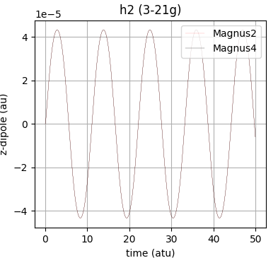

# Time-Dependent Hartree-Fock
This module is based on [Josh Going's blog](https://joshuagoings.com/2017/06/15/magnus/) and [this paper](https://www.researchgate.net/publication/338149703_Numerical_integrators_based_on_the_Magnus_expansion_for_nonlinear_dynamical_systems). The Magnus expansion uses a complex Hamiltonian to propagate forward in time. This implementation calculates the dipole moment at every time step (although other properties could be used) and the resulting dipole variation is plotted. The dipole oscillations can then be transformed to form an absorption spectrum. The routines are

1.  **tdhf(do, run, shape, units ):**

	parameters - *do* is a list of parameters defining the problem as \[ '2' | ,'4' |, 'file\[n]', \['noplot']]. at least '2' or '4' must be specied denoting the magnus order(s) to be computed. If 'file[n]' (n is 2 **or** 4) is specified then the dipole and time values are output to an **npz** file for post-processing. To suppress plotting of results include 'noplot'. This file will be called '<molecule name>-<basis name>-tdhf.npz' with keys p - \[order of Magnus, x units, y units, pulse type, field strength, time step, maximum iterations, polarization], t - the time values, e - the SCF energy, d - the dipole values and f - the field values. *run* is a list of \[time step, maximum iterations, polarization] eg \[0.2, 1000, 'z']. *shape* is a list defining the applied field \[type, strength, rho] eg \['kick', 0.0001] will deliver an impulse of 0.0001 at time t=0 and 0.0000 for t>0, See **pulse** routine for more details. *units* are a list of the units to be used for x and y axes. for x they can be 'fs' or 'atu' and for dipole 'debye' or 'au'. The following subroutines are contained in tdhf. Returns time,SCF energy,  dipole and frequency as numpy arrays, if '2' and '4' are specified will return for '4'.

2.  **initialise()**

    parameters - None. Routine does a ground state scf calculation to reset integrals needed for the tdhf process.

3.  **pulse(t, type = 'gaussian')**

	parameters = *t* is the time and *type* is the shape of the initial pulse \['kick' | 'gaussian']. The Gaussian shape is define as exp[-&tau;<sup>2</sup>/2&rho;<sup>2</sup>).The default rho (standard deviation of Gaussian) is 0.1, so 1/2&rho;<sup>2</sup> is 50. A more general Gaussian pulse could be defined by

        fieldStrength * exp(-(t-pulseCenter)*(t-pulseCenter)/(2*pulseWidth*pulseWidth)) * sin(fieldFrequency*t + fieldPhase)

4.  **commutator(a, b)**

    parameters - *a* and *b* are matrices. Returns the commutator bracket of *a* and *b*, that is ab - ba.

5.  **orthoField(t)**

    parameter - *t* is the time. Calculates the field contribution to the Hamiltonian by applying the pulse to the relevant dipole component. Returns the Hamiltonian component due to the dipole field in the orthogonal basis.

6.  **updateFock(density, engine = 'aello')**

    parameters - *density* is the complex density matrix and *engine* is the integral engine to use. The default is to use **tdhfFock** from the aello module, this has been written as this step is time consuming in native mode. Two-electron repulsion integrals are used with the core Hamiltonian to produce a complex Fock matrix. Returns a complex Fock matrix.

7.  **updateState(u, cycleDensity)**

    parameters - *u* is the propagated Hamiltionian and *cycleDensity* is the density used for dipole calculation in this present cycle. Returns orthogonal density and Fock matrices. Calls updateFock.

8.  **updateEnergy(molAtom, molBasis, fock, density)**

    parameters - *molAtom* is am array of atom objects, *molBasis* is an array of basis objects, *fock* is the Fock matrix and *density* the density matrix. Computes the energy for the cycle, calls nuclearRepulsion and returns total scf energy.

9.  **magnus2(h, orthoFock, orthoDensity, density)**

    parameters - *h* is the time step size time -i, *orthoFock* is the initial Fock matrix, *orthoDensity* the initial (ground state) density and *density* is the initial density matrix in the non-orthogonal basis. Routine preforms the Magnus at order 2. The time is propagated using a Hamiltonian based unitary operator e<sup>-iHt</sup>. The dipole is calculated at each step and the array of those values is returned after the required number of steps has been carried out, along with the field, energy and time arrays.

10. **magnus4(h, orthoFock, orthoDensity, density)**

    parameters - *h* is the time step size time -i, *orthoFock* is the initial Fock matrix, *orthoDensity* the initial (ground state) density and *density* is the initial density matrix in the non-orthogonal basis. Routine preforms the Magnus at order 4. 

11. **tdhfFile(ft, fe, fd, ff, fs)**

    parameters - *ft* the array of time values, *fe* is an array of SCF energy values, *fd* is an array of dipole vales, *ff* is an array of field values and *fs* is a string which is either '2' or '4' denoting the level of Magnus array values relate to.


Plots of the dipole v time are output (see examples later). This is how to run a Magnus 2 writing results to file, with a time step of 0.2 (atu) with 1000 steps in the 'z' direction, with a 'gaussian' pulse of maximum strength 0.0001 giving the results in atomic units.

          tdhf(['2', 'file[2]'], [0.2, 1000, 'z'], ['gaussian', 0.0001, 0.1], ['atu', 'au'])

The next routines are devoted to a spectral analysis of the dipole results of the Magnus expansions above.  Following Josh Goings in McMurchie-Davidson program it uses Pade approximants, details of which can be found [here](https://www.researchgate.net/publication/304667651_Accelerated_Broadband_Spectra_Using_Transition_Dipole_Decomposition_and_Pade_Approximants) and a more general article [here](https://en.wikipedia.org/wiki/Pad%C3%A9_approximant).

12. **pade(p, q, w)**

    parameters - *p* are coefficients of numerator power series, *q* are coeffiecints of denominator power series and *w* value at which series are to be evaluated at. Routine calculates the Pade table entries via the extended Euclidean algorithm for polynomial greatest common divisor. Returns *p(w)*/*q(w)*.

13. **toeplitz(type, col, row = 0)**

    parameters - *type* can be 'make', which creates a Toeplitz matrix or 'Ltri' which creates a strictlt lower diagonal Toeplitz matrix. *col* is a list of elements defining the first column of the Toeplitz matrix and *row* (optional) is the first row of the Toeplitz matrix. If *row* is zero then row will equal *col*. A Toeplitz matrix such that A<sub>i,j</sub> = A<sub>i+1,j+1</sub> = a<sub>i-j</sub> [wikipedia](https://en.wikipedia.org/wiki/Toeplitz_matrix). Although Toeplitz matrices may seem esoteric they are closely related to Fourier series. Returns a Toeplitz matrix defined by *col* and *row*.

14. **solveSpectrum(x, y, options)**

    parameters - *x* and *y* are arrays of horizontal and vertical axes values. *options* are the damping factor, maximum number of points allowed to be processed, limit of horizontal (time) axis, the number of sample points on horizonatal axis, the component of spectrum to be returned from getSpectrum ['r' | 'i' | 'a'] ie either real, imaginary or absolute value and the maximum field strength. This routine makes the data zero based, damps the data, solves the Toeplitz system and calculates the Pade approximant. Remember polynomials become differential operators and vice versa when switching between spatial and Fourier coordinates, and products become convolutions and vice versa. Returns spectrum (x and y).

15. **getSpectrum(time, dipole, options)**

    parameters - *time*, and *dipole* are arrays and *options* are the options discussed in solveSpectrum above. Routine calls solveSpectrum for dipole and the field seperately. Can return real, imaginary or absolute components as spectrum. For imaginary the absorption spectrum (y) and frequency (x) as arrays are returned. The absorption spectrum is calculated as equation 33 in 'Real-time Time-dependent electronic Structure Theory' - J Goings et al.

The following runs a spectrum using data saved from a previous Magnus computation...

		data = np.load('h2o-3-21g-tdhf.npz')

		d = data['d']
		t = data['t']
		p = data['p']

		spec, freq = getSpectrum(t, d, [50.0, 5000, 2.0, 0.0001, 'i', 0.0001])

This can be used to plot the spectrum which has been damped by 50.0 (1/(2&rho;<sup>2</sup>)), the energy range is 2.0 * au->eV (27.2114), in 0.0001 intervals.

We can look at an example using Harpy with McMurchie-Davidson program examples/real-time.py.

running...

		tdhf(['2', '4'], [0.05, 1000, 'z'], ['gaussian', 0.0001, 0.1], ['atu', 'au'])
		
we get 

then running (with data from saved npz-file)...

		spec, freq = getSpectrum(t, d, [50.0, 5000, 2.0, 0.0001, 'i', 0.0001])

we get 


Using...

16. **getPeaks(spectrum, frequency, tolerance)**

    parameters - *spectrum* and *frequency* are the values returned by getSpectrum and *tolerance* is the level below which peaks will be ignored. Returns and array \[nPeaks].

Running getPeaks from the data returned by getSpectrum as...

		maxima = getPeaks( spec, freq, 0.1)

		print('There are ', len(maxima), ' peaks')
		for i in range(len(maxima)):
			print('Peak ',i, 'at energy ', "%0.4f" % maxima[i] + ' eV    '  + \
			                               "%0.4f" % (getConstant('eV[-1]->nm') /maxima[i]))
		

gives...

	There are  2  peaks
	Peak  0 at energy  15.5078 eV    79.9497 nm
	Peak  1 at energy  46.3927 eV    26.7249 nm

compared to Gaussian16 LR-TDHF (calculation by Josh Goings see Issue #8 Real Time Magnus - McMurchie-Davidson program)...

	Excitation energies and oscillator strengths:
	   Excited State   1:      Singlet-SGU   15.4997 eV   79.99 nm  f=0.6685  <S**2>=0.000
       1 ->  2         0.70960

       Excited State   3:      Singlet-SGU   46.4065 eV   26.72 nm  f=0.0381  <S**2>=0.000
       1 ->  4         0.70804

We can run a RPA calculation and we get...
0.361476 (t) 	0.569602 (s) 	0.945233 (t) 	1.175137 (s) 	1.462167 (t) 	1.705407 (s)
The first singlet is 0.569602 (15.4994 eV) and the third 1.705407 (46.4058 eV). The second singlet has 0 oscillator strength and so no peak.
If you use 4th order Magnus the values are 15.5103 and 46.4084 eV - so results probably good to first decimal place.

Another example is water in 6-31g basis, this is a NWChem example found [here](https://nwchemgit.github.io/RT-TDDFT.html#Hints_and_Tricks).
The code used was 

	import matplotlib.pyplot as plt
	plt.grid()
	plt.title('Magnus 2   water dipoles')

	eV = getConstant('hartree->eV')
	field = 0.0001

	t, _, dx, f = tdhf(['2', 'noplot'], [0.2, 1000, 'x'], ['kick', field], ['atu', 'au'])
	specX, freqX = getSpectrum(t, dx, [50.0, 5000, 1.0, 0.0001, 'i', field])

	t, _, dy, f = tdhf(['2', 'noplot'], [0.2, 1000, 'y'], ['kick', field], ['atu', 'au'])
	specY, freqY = getSpectrum(t, dy, [50.0, 5000, 1.0, 0.0001, 'i', field])

	t, _, dz, f = tdhf(['2', 'noplot'], [0.2, 1000, 'z'], ['kick', field], ['atu', 'au'])
	specZ, freqZ = getSpectrum(t, dz, [50.0, 5000, 1.0, 0.0001, 'i', field])

	scaling = max(np.max(specX), np.max(specY), np.max(specZ))

	plt.plot(freqX*eV,specX/scaling,label='x',color='red')
	plt.plot(freqY*eV,specY/scaling,label='y',color='blue')
	plt.plot(freqZ*eV,specZ/scaling,label='z',color='orange')

	plt.legend(loc=1)
	plt.xlabel('Energy (eV)')
	plt.ylabel('scaled $\sigma(\omega)$ [arb. units]')
	plt.show()

This uses a 'kick' 0f field 0.0001 at time t=0 and results in the following plot...

Here the peaks occur at about 9.3742(x), 11.7742 (z), 13.9484(y), 15.5130(y) and 19.1375(z) eV as calculated by getPeaks, compared to RPA
0.305998 (t) 	0.343664 (s) 	0.365701 (t) 	0.388721 (t) 	0.414205 (s) 	0.429453 (t)
0.431863 (s) 	0.504256 (t) 	0.508056 (s) 	0.555931 (t) 	0.569053 (s) 	0.702016 (s)
First singlet at 9.3524, second at 11.2708 (zero strength), third at 11.7524, fourth at 13.8259, fifth at 15.4858 and sixth at 19.1021 eV.


17. **TDHFproperties(molAtom, molBasis, charge, c, fock, ERI, method, TDHFdata)**

    parameters - *molAtom* is an array of atom objects, *molBasis* is an array of basis objects (the molecular basis), *charge* is the molecular charge, *c* are the orbital eigenvectors, *fock* the final Fock matrix, *ERI* the 2-electron repulsion integrals, *method* is the excitation calculation method currently only 'tamm-dancoff' is supported and *TDHFdata* is the [number of doubley occupied orbitals, number of spatial virtual orbitals, number of roots to be calculated]. Routine has a subroutine **integral(type, molAtom, molBasis, co, cv)** where *type* is one of \['dipole','nabla','angular'], *molAtom* and *molBasis* as defined for main routine, *co* and *cv* are occupied and virtual slices of the eigenvectors. *integral* returns the 3 components of the molecular property requested. 'dipole' and 'nabla' are returned in the *nuclear charge* gauge whilst 'angular' is returned in the *origin* gauge (compatible with psi4). The main routine calls a TDHF-RPA mode to determine the excited state eigenvalues and vectors then for each root requested returns an array of dictionaries,

    1. The excitation energy 

    2. The electric transition dipole in the length gauge (<&#968;<sub>0</sub>|**&#956;**|&#968;<sub>i</sub>>) is calculated as \
    (2)<sup>1/2</sup>&#931; **&#956;.**|**X**<sub>n</sub>>

    3. The electric oscillator strength in the length gauge calculated as 
    (2/3) **e**<sub>n</sub>&#931; **&#956;**<sub>ti</sub><sup>2</sup>, where **&#956;**<sub>ti</sub> are the components of the length transition dipole.

    4. The electric transition dipole in the velocity gauge (<&#968;<sub>0</sub>|**&nabla;**|&#968;<sub>i</sub>>) is calculated as \
    (2)<sup>1/2</sup>&#931; **&#968;.**|**X**<sub>n</sub>>

    5. The electric oscillator strength in the velocity gauge calculated as 
    (2/3**e**<sub>n</sub>)&#931; **&#968;**<sub>ti</sub><sup>2</sup>, where **&#968;**<sub>ti</sub> are the components of the velocity transition dipole.

    6. The magnetic transition dipole (length gauge) (<&#968;<sub>0</sub>|**&omega;**|&#968;<sub>i</sub>>) is calculated as
    (1/2)<sup>1/2</sup>**&omega;.**|**X**<sub>n</sub>> \
    If not in Tamm-Dancoff the eigenvector should be the left-eigenvector).

    7. The rotatory strength in the length gauge is calculated as 
    &#931; **&#956;**<sub>ti</sub>**&omega;**<sub>ti</sub> where **&omega;**<sub>ti</sub> are the components of the magnetic transition dipole

    8. The rotatory strength in the velocity gauge is calculated as 
    -&#931; **&nabla;**<sub>ti</sub>**&omega;**<sub>ti</sub> where **&omega;**<sub>ti</sub>/ **e**<sub>n</sub>

    The results are returned as a list of dictionaries, one dictionary for each root. Note wavefunction is determined only up to factor of phase so sign may be undetermined. We (and psi4) defines length-gauge dipole integral to include the electron charge (-1.0).

Here are the comparisons with psi4 for water sto-3g in the Tamm-Dancoff approximation

1st singlet state **0.356462** (psi4)&nbsp;&nbsp;&nbsp;&nbsp;**0.356462** (harpy)
|                                |       x         |       y       |     z      | |        x     |     y    |     z    |
|--------------------------------|-----------------|---------------|------------|-|--------------|----------|----------|
| electric transition dipole (L) |  0.000000       | 0.000000      | 0.099258   | | 0.000000  | 0.000000  |0.099258  |
| electric transition dipole (V) |  0.000000       | 0.000000      | 0.130522   | | 0.000000  | 0.000000  | 0.130522 |
| magnetic transition dipole (L) | -0.302303       | 0.000000      | 0.000000   | |  -0.302303 | 0.000000  | 0.000000  |

|  | | | |
|------------------------|--------------|-|----------|
| oscillator strength (L)| 0.002341     | | 0.002341 |
| oscillator strength (V)| 0.031861     | | 0.031861 |

3rd singlet state **0.505628** (psi4)&nbsp;&nbsp;&nbsp;&nbsp;**0.505628** (harpy)
|                                |       x         |       y       |     z      | |      x     |    y     |    z     |
|--------------------------------|-----------------|---------------|------------|-|------------|-----------|----------|
| electric transition dipole (L) |  0.000000       | 0.438875     | 0.000000   | | 0.000000   | 0.438874 |0.000000 |
| electric transition dipole (V) |  0.000000       | 0.273548      | 0.000000   | | 0.000000   | -0.273549   | 0.000000 |
| magnetic transition dipole (L) |  0.000000       | 0.000000      | 0.000000   | | 0.000000   | 0.000000  | 0.000000  |

|  | | | |
|------------------------|--------------|-|----------|
| oscillator strength (L)| 0.064926     | | 0.064926 |
| oscillator strength (V)| 0.098661     | | 0.098661 |

To test the rotatory strengths used psi4 (S)-methyloxirane in sto-3g from [this reference](https://tinyurl.com/tddft-psicon2020)
1st singlet **0.381675** (psi4)&nbsp;&nbsp;&nbsp;&nbsp;**0.381675** (harpy)
| | | | |
|-----------------------|-------------|-|-----------|
| rotatary strength (L) | 0.004605    | |  0.004605 |
| rotatory strength (V) | 0.001749    | |  0.001748 |

This is an example of how to run a TDHF calculation. Put this in a file and run from harpy/source...
```python
from basis import electronCount
from tdhf import TDHFproperties
import rhf

#run harpy and get run parameters and integrals
molAtom, molBasis, molData = rhf.mol([])
rhf.scf(molAtom, molBasis, molData,[])

charge = molData['charge']

#metrics for TDHF
nOccupied = electronCount(molAtom, charge)//2
nVirtual = len(molBasis) - nOccupied
roots = 3
data = [nOccupied, nVirtual, roots]

#get residues in Tamm-Dancoff Approximation
residues = TDHFproperties(molAtom, molBasis, charge, rhf.C, rhf.fock, rhf.ERI, 'tamm-dancoff', data)

print('TDHF residues for ', molData['name'], ' in the basis ', molData['basis'])
print('excitation    oscillator strengths (L,V)')
print('----------------------------------------')
for r in residues:
    print(" {:f}       {:f}        {:f}".format(r['excitation energy'], \
    	                                        r['oscillator strength (length gauge)'], \
    	                                        r['oscillator strength (velocity gauge)']))
```
18. **TDHFspectrum(spectrum)**

    parameters - *spectrum* is a dictionary with the following keys: *data* - an array of dictionaries of residue results as returned by **TDHFproperties**, *units* - units to used in output either '**nm**' or 'ev', *type* the kind of spectrum to draw either '**opa**' for one-photon absorption or 'ecd' for electronic circular dichroism, *points* are the number of x-axis points to plot (**5000**), *shape* is the type of broadening to be used, either '**gaussian**' for inhomegenous broadening or 'lorentzian' for homegenous broadening and *gamma* is the broadening factor (**0.02**). Defaults are in bold.
    There are 2 contained subroutines

    **profile(p, d = None, mode = 'wave')**
    parameters - *p* is the on which the lineshape is centered, poles, *d* is the domain of the profile and *mode* is either 'wave' where routine returns the lineshape or 'max' which returns the maximum of the band.

    **prefactor()**
    parameters - None. This routine computes the numerical factor of the expressions for opa and edc. The prefactor is computed in SI units and then adjusted for the fact that atomic units are used to express microscopic observables: excitation energies and transition dipole moments. The refractive index *n* is, in general, frequency-dependent. We assume it to be constant and equal to 1. *N<sub>A</sub>* is Avagadro constant, *c* the speed of light, *&#295;* is reduced Planck constant, *e<sub>0</sub>* is the electric constant.

    for absorption need conversion au->Ccm (Coulomb centimeters) \
    *elementary charge x bohr radius x 1000*. (1000 is m->cm)

    prefactor calculated as \
   (4.&#960;.<sup>2</sup>*N<sub>A</sub>*/(3.1000.ln(10).(4.&#960;.*e<sub>0</sub>*).*&#295;*,*c*)).(C->cm)<sup>2</sup> \
  

    for circular dichroism also need conversion au-> JT<sup>-1</sup> (Joules inverse Tesla) \
    2.&mu;<sub>B</sub>.1000*, where &mu;<sub>B</sub> is the Bohr magnetron.

    **the results are given in litres per molecule per centimetre**

    The main routine returns a dictionary with keys *x* - the x-axis convolution, *y* - the y-axis convolution, *poles* the x-axis bar values and *bars* the heights of the residues.

    For water in STO-3G and TDA regime (units = 'nm', gamma = '0.02') the comparison results from psi4 via the jupyter notebook referenced earlier are, giving values for just the first singlet harpy(psi4)...

    |  OPA         |   gaussian       | lorentzian  |
    |--------------|------------------|-------------|
    |  x convolution     |  57.8701 (57.8701) |    | 
    |  y convolution   | 5.366e-03 (5.366e-03) <sup>1</sup> | 824.5057 (824.5071) |
    |  poles      | 127.8212 (127.8211) |   |
    |  bars      | 9.7079e-01 (9.7078e-01)  | 7.7458e-01 (7.7457e-01) |
    
    <sup>1</sup> this is the 5th singlet (1st was 0). eV results also checked and found to be in same sort of agreement.

    To check ECD I've used the (S)-methyloxirane example in the jupyter notebook with STO-3G.

    |  ECD         |   gaussian       | lorentzian  |
    |--------------|------------------|-------------|
    |  x convolution     |  73.0109 (73.0110) |    |
    |  y convolution   | -8.2248e-06 (-8.2322e-06)  | -0.5623 (-0.5627) |
    |  poles      | 119.3774 (119.3773) |   |
    |  bars      | 1.4393 (1.4391)  | 1.1484 (1.1483) |

Run the following code (from source directory for eg (S)-methyloxirane)
```python
from basis import electronCount
from tdhf import TDHFproperties
import rhf

#run harpy and get run parameters and integrals
molAtom, molBasis, molData = rhf.mol([])
rhf.scf(molAtom, molBasis, molData,[])

charge = molData['charge']

#metrics for TDHF
nOccupied = electronCount(molAtom, charge)//2
nVirtual = len(molBasis) - nOccupied
roots = 5
data = [nOccupied, nVirtual, roots]

#get residues in Tamm-Dancoff Approximation
residues = TDHFproperties(molAtom, molBasis, charge, rhf.C, rhf.fock, rhf.ERI, 'tamm-dancoff', data)

#get spectrum data
from tdhf import TDHFspectrum

dict = {'data' : residues, 'units' : 'nm', 'type' : 'opa', 'points' : 5000, 'shape' : 'gaussian', 'gamma' : 0.02}
spectrum = TDHFspectrum(dict)

import matplotlib.pyplot as plt
fig, ax = plt.subplots()

ax.set_xlabel('\u03BB [nm]')
if dict['type'] == 'opa': ax.set_ylabel('\u03B5 [L $mol^{-1}$ $cm^{-1}$')
elif dict['type'] == 'ecd': ax.set_ylabel('\u0394\u03B5 [L $mol^{-1}$ $cm^{-1}$')
plt.grid()
plt.title('(S)-methyloxirane - Gaussian')

ax.bar(spectrum['poles'], spectrum['bars'], width=0.5, color='k')
ax.plot(spectrum['x'], spectrum['y'], color='orange')

plt.show()
```
this will produce either of the following plots...


- - -
### TD-CCSD
This follows [Linear Absorption Spectra from Explicitly Time-Dependent Equation-of-Motion Coupled-Cluster Theory- Nascimento & DePrince](https://pubs.acs.org/doi/full/10.1021/acs.jctc.6b00796). The dipole is propogated in time using a 4th-order Runge-Kutta algorithm. We have propagated the right-hand amplitudes of the dipole (autocorrelation) function which are given by\
*m*<sub>0</sub> = &mu;<sup>i</sup><sub>i</sub>\
*m*<sup>a</sup><sub>i</sub> = &mu;<sup>i</sup><sub>a</sub>\
*m*<sup>ab</sup><sub>ij</sub> = 0.0

The left-hand amplitudes are\
**m**<sub>0</sub> = &mu;<sup>i</sup><sub>i</sub> + &mu;<sup>i</sup><sub>a</sub>&lambda;<sup>i</sup><sub>a</sub>\
**m**<sup>a</sup><sub>i</sub> = &mu;<sup>i</sup><sub>i</sub> + &mu;<sup>a</sup><sub>b</sub>&lambda;<sup>i</sup><sub>b</sub> - (&mu;<sup>i</sup><sub>j</sub>&lambda;<sup>j</sup><sub>a</sub> - &mu;<sup>j</sup><sub>j</sub>&lambda;<sup>i</sup><sub>a</sub>) + &mu;<sup>j</sup><sub>b</sub>&lambda;<sup>ij</sup><sub>ab</sub>\
**m**<sup>ab</sup><sub>ij</sub> =  &mu;<sup>j</sup><sub>b</sub>&lambda;<sup>i</sup><sub>a</sub> +  &mu;<sup>k</sup><sub>k</sub>&lambda;<sup>ij</sup><sub>ab</sub> + P(ab){ &mu;<sup>a</sup><sub>c</sub>&lambda;<sup>ij</sup><sub>cb</sub>} - P(ij){ &mu;<sup>i</sup><sub>k</sub>&lambda;<sup>kj</sup><sub>ab</sub>}

The time derivatives of the *m*-amplitudes are\
d/dt[*m*<sub>0</sub>] = *m*<sup>a</sup><sub>i</sub>F<sub>ai</sub>sub> + 0.25*m*<sup>ab</sup><sub>ij</sub>g<sub>ijab</sub> [24]\
d/dt[*m*<sup>a</sup><sub>i</sub>] = *m*<sup>b</sup><sub>i</sub>F<sub>ab</sub> - *m*<sup>b</sup><sub>j</sub>F<sub>ij</sub> + *m*<sup>b</sup><sub>j</sub>W<sub>jabi</sub> + *m*<sup>ab</sup><sub>ij</sub>F<sub>jb</sub> - 0.5*m*<sup>ab</sup><sub>jk</sub>W<sub>jkib</sub> + 0.5*m*<sup>bc</sup>sup><sub>ij</sub>W<sub>ajbc</sub> [25]\
d/dt[*m*<sup>ab</sup><sub>ij</sub>] = P(ab){*m*<sup>b</sup><sub>m</sub>W<sub>maij</sub>} + P(ij){(*m*<sup>e</sup><sub>n</sub>W<sub>mnie</sub>)t<sup>ab</sup><sub>jm</sub>} - P(ij){*m*<sup>e</sup><sub>j</sub>W<sub>abei</sub>} - P(ab){(*m*<sup>f</sup><sub>m</sub>W<sub>amef</sub>)t<sup>be</sup><sub>ij</sub>} + P(ij){*m*<sup>ab</sup><sub>mj</sub>F<sub>mi</sub>} + P(ij){(0.5*m*<sup>ef</sup><sub>in</sub>g<sub>mnef</sub>)t<sup>ab</sup><sub>jm</sub>} + P(ab){*m*<sup>ae</sup><sub>ij</sub>F<sub>be</sub>} + P(ij){(0.5*m*<sup>af</sup><sub>mn</sub>g<sub>mnef</sub>)t<sup>be</sup><sub>ij</sub>} + P(ij)P(ab){*m*<sup>ae</sup><sub>mj</sub>W<sub>mbei</sub>} + 0.5*m*<sup>ab</sup><sub>mn</sub>W<sub>mnij</sub> + 0.5*m*<sup>ef</sup><sub>ij</sub>W<sub>abef</sub>

The intermediates F and W are given in cc.md. *t* are the ccsd-singles and doubles amplitudes and *&lambda;* are the &Lambda;-ccsd singles and doubles amplitudes. &mu; are the dipoles in the MO spin basis. The auto-correlation function is evaluated at each step as\
f<sub>ac</sub> = **m**<sub>0</sub>*m*<sub>0</sub> + **m**<sup>a</sup><sub>i</sub>*m*<sup>a</sup><sub>i</sub> + 0.25**m**<sup>ab</sup><sub>ij</sub>*m*<sup>ab</sup><sub>ij</sub>

19. **td_ccsd(molAtom, molBasis, ts, td, ls, ld, ims, fockMOspin, eriMOspin, run, metrics)**
    
    parameters - *molAtom* is an array of atom objects, *molBasis* is an array of basis objects (the molecular basis), *charge* is the molecular charge, *ts* and *td* are the converged CCSD singles and doubles amplitudes, *ls* and *ld* are the converged &Lambda;-CCSD singles and doubles amplitudes, *fockMOspin* the final Fock matrix in the molecular spin basis, *eriMOspin* the 2-electron repulsion integrals in the molecular spin basis and *run* are the parameters for the calculation ie [time_step, step count, polarization]. The *metrics* are [number of spin orbitals, number of electrons]. Returns [time] , [dipole] lists.

The following code is an example of using &Lambda;-CCSD with harpy (it was used to generate a dipole plot for H<sub>2</sub> in 3-21g basis as a test against psi4).
```python
import rhf
from integral import buildFockMOspin, buildEriMO, buildEriDoubleBar
from cc.scc import ccsd_lambda
from basis import electronCount
import numpy as np

from tdhf import td_ccsd
if __name__ == '__main__':

	#do a reference scf calculation
	atoms, basis, data = rhf.mol([])
	eSCF = rhf.scf(atoms, basis, data,[])

	charge, iterations, tolerance, diis, gauge = data['charge'], data['cycles'], 1e-10, data['diis'], data['gauge']

	#get t amplitudes from ccsd calculation
	from cc.scc import ccsd
	eCCSD, ts, td = ccsd(atoms, rhf.C, charge, rhf.fock, rhf.ERI, iterations, tolerance, eSCF, diis)

	#metrics
	spinOrbitals = rhf.C.shape[0] * 2
	nElectrons = electronCount(atoms, charge)

	#get fock in MO spin basis
	fockMOspin = buildFockMOspin(spinOrbitals, rhf.C, rhf.fock)

	#get two-electron repulsion integrals in MO basis
	eriMO = buildEriMO(rhf.C, rhf.ERI)
	eriMOspin = buildEriDoubleBar(spinOrbitals, eriMO)
	
	#calculate lambda amlplitudes and pseudoenergy
	eLCCSD, ls, ld, ims = ccsd_lambda(fockMOspin, eriMOspin, ts, td, nElectrons, iterations, tolerance)

	print("SCF energy   {:>12f} Hartree".format(eSCF))
	print("CCSD energy  {:>12f} Hartree".format(eCCSD))
	print('\u039B-CCSD energy' "{:>12f} Hartree".format(eLCCSD))

	#Time-dependent CCSD
	polarization = 'z'
	time, dipoles = td_ccsd(atoms, basis, ts, td, ls, ld, ims, fockMOspin, eriMOspin, [0.05, 1000, polarization], [spinOrbitals, nElectrons])

	import matplotlib.pyplot as plt
	from atom import getConstant
	plt.grid()
	plt.title('TD-EOM-CCSD harpy comparision')
	plt.plot(np.array(time) * getConstant('atu->femtosecond'),np.array(dipoles).real * getConstant('au->debye') ,label=u"\u211D",color='red', lw=0.7)
	plt.plot(np.array(time) * getConstant('atu->femtosecond'),np.array(dipoles).imag * getConstant('au->debye') ,label=u"\U0001D540",color='blue',lw=0.7)
	plt.legend(loc=1)
	plt.xlabel('time (fs)')
	plt.ylabel('dipole (Debye)')
	plt.show()
```
The comparison plots for harpy and psi4 are shown below.


