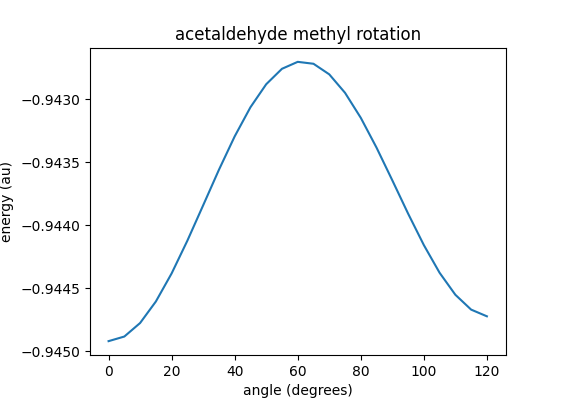

# molecular conformation

One important question is 'what conformation does an individual molecule adopt?'. For example in acetaldehyde H3C-CH-O what conformation does the methyl group adopt with respect to the plane of the aldehyde group? 

There are two logical answers, either 1) a methyl hydrogen lies in the plane and adjacent to the oxygen or 2) it lies in the plane adjacent to the aldehyde hydrogen. Intuition tells us that the (+) hydrogen will be attracted to the (-) oxygen so we expect case 1). This is backed-up by the geometry of the reference acetaldehyde molecule in project.hpf which has geometry 1. But let's assume we don't know the answer and see how to do a conformational analysis.

We will need some imports

	import rhf
	import math
	import numpy as np
	import atom

First we need to know how to rotate a point in space about an arbitrary axis. [This is good site to explain the procedure](https://sites.google.com/site/glennmurray/Home/rotation-matrices-and-formulas/rotation-about-an-arbitrary-axis-in-3-dimensions). A python('ish') version of the algorithm is 

	def rotate( a, molAtom, theta):
		#rotate by angle theta about axis a

		#radians
		theta *= np.pi/180.0

		#get axis
		i = int(a[:a.find('-')])
		j = int(a[a.find('>')+1:])

		#vector along axis
		a,b,c = molAtom[i].center[:]
		d,e,f = molAtom[j].center[:]

		#normalise axis
		axis = molAtom[j].center[:] - molAtom[i].center[:]
		axis /= np.linalg.norm(axis)
		u,v,w = axis[:]

		#evaluate trigonmetric functions
		s = math.sin(theta) 
		c = math.cos(theta)

		#tranformation matrix
		T = np.eye(4)
		T[0,0] = u*u + (v*v+w*w)*c
		T[0,1] = u*v*(1.0-c) - w*s
		T[0,2] = u*w*(1.0-c) + v*s
		T[0,3] = (a*(v*v+w*w) - u*(b*v+c*w))*(1.0-c) + (b*w-c*v)*s

		T[1,0] = u*v*(1.0-c) + w*s
		T[1,1] = v*v + (w*w+u*u)*c
		T[1,2] = v*w*(1.0-c) - u*s
		T[1,3] = (b*(u*u+w*w) - v*(a*u+c*w))*(1.0-c) + (c*u-a*w)*s

		T[2,0] = u*w*(1.0-c) - v*s
		T[2,1] = v*w*(1.0-c) + u*s
		T[2,2] = w*w + (u*u+v*v)*c
		T[2,3] = (c*(u*u+v*v) - w*(a*u+b*v))*(1.0-c) + (a*v-b*u)*s

		return T

This takes a definition of the rotation axis given as eg '0->1' the arrow points towards the rotated atoms. So in out example C1 (atom 0) is the methyl carbon (and has the atoms to be rotated) and C2 (atom 1) is the aldehyde carbon, so out rotor will be '1->0'. *molAtom* is the molecular atom object containing the geometry and *theta* is the angle to be rotated through in **degrees**. The routine returns a transformation matrix which has dimension [**4**, **4**].

Next we can define the conformation analysis by

	#define conformation range
	angles = {'start' : 0, 'increment' : 5, 'number' : 25, 'rotor' : '1->0'}

We need to know which subset of the atoms to rotate, we could give them as a manually prepared list or write an automatic procedure along the lines of

	def rotationGroup(i, group, rotor):
		#get the atoms to be rotated

		#atom connections
		bond = atom.bondMatrix(molAtom)
		row = bond[i,:]

		#recurse connections of this atom
		for j in range(bond.shape[1]):

			if rotor == j: continue
			if (i != j) and (row[j] == 1) and not (j in group):
				group.append(j)
				rotationGroup(j, group, rotor)

		return group

This takes *i* the atom who's connected atoms are required, *group* is a list of the atoms in the rotated group found so far and *rotor* is the atom i in the axis definition 'i->k. The connections of the atom i are found from the bond matrix row (i), if the atom is the *rotor* we go on the the next atom as we don't want any atoms connected to that end of the axis of rotation. Now if the atom is not the atom i and there is a connection (bond matrix element is 1) and we don't already have the atom in our group, then add it to the group and see whats connected to that atom. Thus we end up with a list of atoms to be rotated, in our case the list is

    [4, 0, 5, 6]

We finally have to remove the k end of 'i->k' when group is returned. This is done by

	#get axis
	a = angles['rotor']
	i = int(a[:a.find('-')])
	j = int(a[a.find('>')+1:])

	#get matrix of column vectors of atoms to be rotated
	group = []
	group = rotationGroup(j, group, i)
	group.remove(j)

We now have our group of atom to rotate

    [4, 5, 6]

get the molecular geometry, define a matrix of the geometry of the atoms to be rotated, and a matrix to hold the transformed molecular geometry after rotation. Note the column vector must be [x, y, z, 1] to be compatible which transformation matrix which is why we initialise rotationGroup matrix to ones not zeros.

	nRotate = len(group)
	rotationGroup = np.ones((4, nRotate))

	for p in range(nRotate):
		rotationGroup[:3, p] = molAtom[group[p]].center[:]

	geo = np.zeros((nAtoms,3))

Now the main loop

	for theta in range(angles['number']):

		#get rotation matrix
		phi = angles['start'] + angles['increment'] * theta	
		T = rotate(angles['rotor'], molAtom, phi)

		#rotate about axis
		for p in range(nAtoms):
			if p in group:
				idx = group.index(p)
				geo[p,:] = np.dot(T, rotationGroup)[:3,idx]
			else:
				geo[p,:] = molAtom[p].center[:]

		#update geometry
		molAtom, molBasis = rhf.rebuildCenters(molAtom, molBasis, geo)

Calulate the angle to be rotated through, get transformation matrix for that rotation, update rotated atom positions, rebuild the atomic centers and we're ready to do the scf calculation.

Finally if we initialise a list for the energies before the loop

	e = []

and after the rebuild add

		#solve
		e.append(rhf.scf(molAtom, molBasis, molData, []))

then we can finish up with

	import matplotlib.pyplot as pl

	pl.figure()
	pl.title('acetaldehyde methyl rotation')
	pl.xlabel('angle (degrees)')
	pl.yLabel('energy (au)')
	pl.plot(range(0, 121,5), e)
	pl.show()

If we run the above code we get

This shows that scenario 1. is the minimum energy conformation and scenario 2 is, in fact, a maximum. (the geometry is not quite symmetrical so the energy curve is slightly asymmetric). This is the basic idea of how you can explore conformational energy curves and surfaces.

