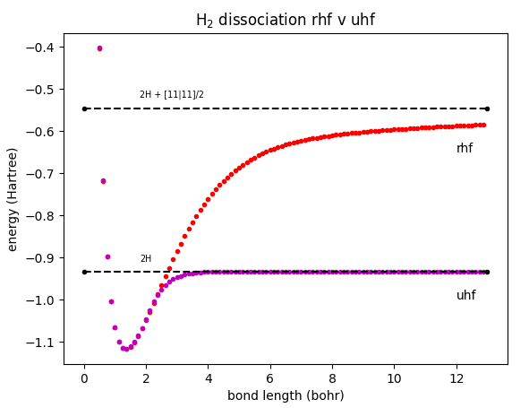

# H<sub>2</sub> dissociation - a comparison of RHF and UHF

This follows the study in Szabo & Ostlund on pages 165-167. The idea is to see what happens to a hydrogen molecule as the bond length is moved through the range 0.5 to 12 bohr. With RHF we see an improvement in the energy to a minimum (~-1.2 at ~1.5 bohr) and then a gradual increase asymptotically to a level of ~-5.5 au. Logically one would expect the final energy of the system to be the energy of two individual hydrogen atoms. The energy of a single hydrogen atom is ~0.4666 au so one would expect the total energy of the system given by RHF to be ~-0.9332 not ~-5.5!

With UHF we see initially a similar behaviour, the curves follow each other through the minimum but then the behaviour changes. Although again the curve tends asymptotically to a value this time it's the expected energy of 2 hydrogen atoms. 



In the UHF case for the dissociated molecules there are two MO's so each hydrogen has one to accomodate it's electron, however in the RHF case both electrons must occupy the same MO, this leads to a H<sup>+</sup> - H<sup>-</sup> configuration rather than H - H. This means in the RHF case in addition to the two isolated hydrogen atoms there is still a extra contribution from the one-center electron repulsions due to the fact there are still two electrons sharing an MO. This contribution is half the [00|00] contribution in the H<sup>2</sup> case. 

You can run this (given the directory structure here from harpy/source) as 

		python3 ../test/h2-dissociation.py

These plots are using the following molecule definition
```
name=h2
matrix=c
diis=off
basis=sto-3g
post={}

H1 1 0.00000000000000  0.00000000 0.00000000000
H2 1 1.39838996182773  0.00000000 0.00000000000

end
```